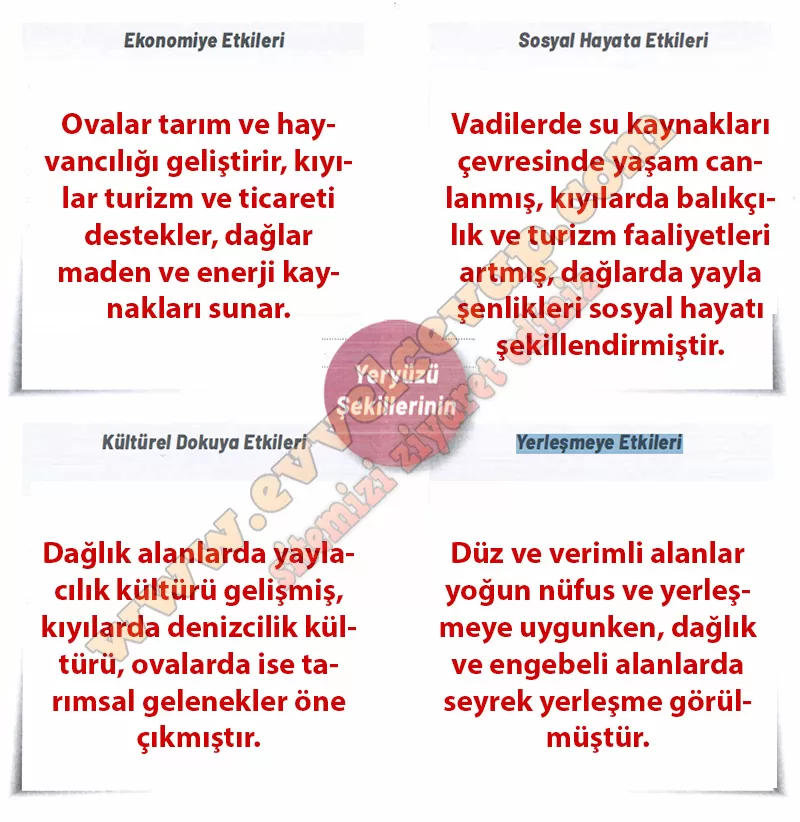

# 10. Sınıf Coğrafya Kitabı Cevapları Meb Yayınları Sayfa 102

---

**Yeryüzü Şekillerinin Beşerî Faaliyetlere Etkisi**

**Amaç**: Yakın çevrenizdeki yeryüzü şekillerinin beşerî faaliyetlere olan etkilerini sorgulayabilme

**Yönerge**: Aşağıdaki işlem adımlarını uygulayınız.

**Soru: Ders öncesi düzenlediğiniz bilgilerden yararlanarak yeryüzü şekillerinin ekonomiye, sosyal hayata, kültürel dokuya ve yerleşmeye olan etkilerine yönelik görüşlerinizi aşağıdaki alanlara yazınız.**

-   **Cevap**:

