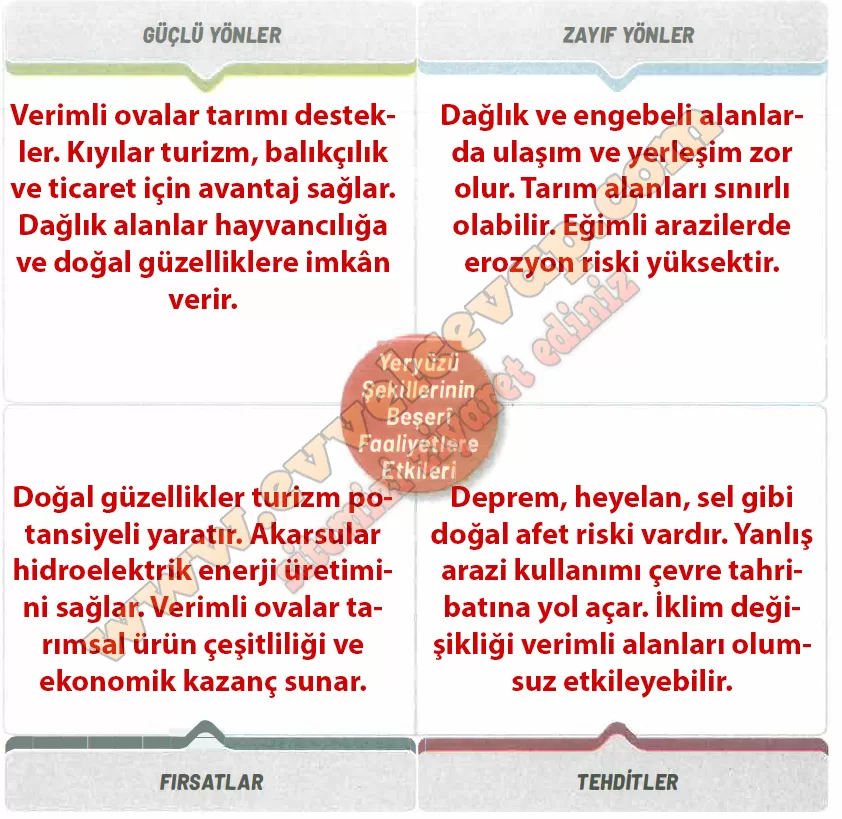

# 10. Sınıf Coğrafya Kitabı Cevapları Meb Yayınları Sayfa 103

---

**Soru: Yaşadığınız yerdeki yeryüzü şekillerinin beşerî faaliyetlere olan etkilerini GZFT analiz tekniğine göre çözümleyiniz.**

-   **Cevap**:

**Soru: Yaşadığınız yerdeki yeryüzü şekillerine bağlı ortaya çıkan beşerî faaliyetler sırasında doğal çevrenin korunması için farkındalık oluşturmaya yönelik sloganlar yazarak arkadaşlarınızla paylaşınız.**

-   **Cevap**: Doğayı koru, geleceğini yaşat! · Yeryüzü şekilleri mirasımızdır, sahip çıkalım! · Doğal güzelliklerimizi tüketme, gelecek nesillere ilet! · İnsan yaşar, doğa yaşarsa!