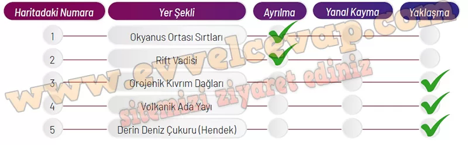

# 10. Sınıf Coğrafya Kitabı Cevapları Meb Yayınları Sayfa 109

---

**Soru: 4 ve 6. soruları aşağıda verilen metin ve haritaya göre cevaplayınız.**

Levha tektoniği kuramına göre levhalarda ayrılma (uzaklaşma), yanal kayma (transform) ve yaklaşma (çarpışma) şeklinde hareketler gerçekleşir. Bu hareketlere bağlı olarak karalarda ve okyanus tabanlarında çeşitli yer şekilleri oluşur. Aşağıdaki haritada kırmızı çizgiler levha sınırlarını, mavi çizgiler yaklaşan levhaların sınırlarını, mor çizgiler ise yanal kayma gerçekleşen levha sınırlarını göstermektedir. Harita üzerinde levha sınırlarında yer alan 5 farklı bölge belirlenmiştir.

**Soru: 4) Haritadaki numaralanmış alanlarda bulunan yer şekli ve bu şeklin oluşumunda etkili olan levha hareketini aşağıdaki tabloya işaretleyiniz.**

-   **Cevap**:

**Soru: 5) Levha hareketlerine bağlı olarak kara üzerinde ve okyanus tabanlarında oluşan yer şekillerini şemaya yazınız.**

-   **Cevap**:

