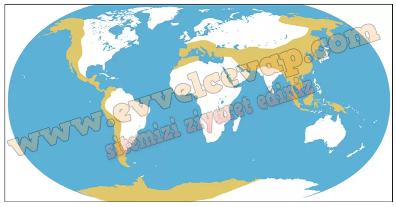

# 10. Sınıf Coğrafya Kitabı Cevapları Meb Yayınları Sayfa 110

---

**Soru: 6-8. soruları aşağıda verilen bilgi ve haritalara göre cevaplayınız.**

Orojenez, levhaların yaklaştığı bölgelerde tortul tabakaların kıvrılmasıyla ya do kırılarak yükselmesiyle meydana gelen dağ oluşumudur. Orojenez sonucu oluşmuş olan dağlar haritada gösterilmiştir.

**Soru: 6) Haritada verilen dağları oluşum zamanlarına göre genç oluşumlu olanları (G), daha eski dönemlerde oluşmuş olanları (E) harfiyle ilgili alana yazınız.**

-   **Cevap**:

**Soru: 7) Belirlemiş olduğunuz genç oluşumlu dağların konumlarından hareketle aşağıdaki dilsiz harita üzerine çarpışan levhaların sınırlarını çiziniz.**

-   **Cevap**:

