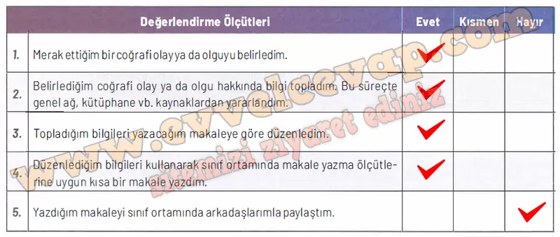

# 10. Sınıf Coğrafya Kitabı Cevapları Meb Yayınları Sayfa 24

---

**Öz Değerlendirme Formu**

**Soru: Aşağıda verilen ölçütler, kendi çalışmanız hakkında belirlemeler yapmanız için düzenlenmiştir. Çalışmanızla ilgili ifadeler size uygunsa “Evet”i, biraz uygunsa “Kısmen”i, uygun değilse “Hayır”ı işaretleyiniz. Tüm ifadeleri işaretlemeyi unutmayınız.**

-   **Cevap**:

**Soru: Çalışmanız hakkındaki görüşlerinizi yazınız.**

-   **Cevap**: Çalışma bana iklim değişikliğinin sebeplerini ve sonuçlarını daha iyi öğretti.

**✅Çalışmam sırasında öğrendiğim bilgiler**: İklim değişikliğinin tarımı, su kaynaklarını ve canlı yaşamını doğrudan etkilediğini öğrendim.

**✅Çalışmam sırasında zorlandığım yerler**: Bilgileri kısa ve anlaşılır cümlelerle makaleye aktarmakta biraz zorlandım.

**✅Çalışmamı yeniden yapacak olsaydım dikkat edeceğim hususlar**: Daha fazla kaynaktan bilgi toplar ve yazımı daha düzenli bir şekilde sunardım.

**Soru: Değerlendirme: Çalışmalarınızı verimli bir şekilde sürdürebilmeniz için “Hayır” ve “Kısmen” seçeneklerini işaretlediğiniz konular ile çalışma sırasında zorlandığınız öğrenmeleri tekrar ediniz. İhtiyaç duyduğunuz konularda öğretmeninizden destek alarak eksiklerinizi tamamlayınız.**

-   **Cevap**: Kısmen yaptığım noktaları tekrar etmeli ve öğretmenimden yazım düzeni konusunda destek alarak eksiklerimi tamamlamalıyım.