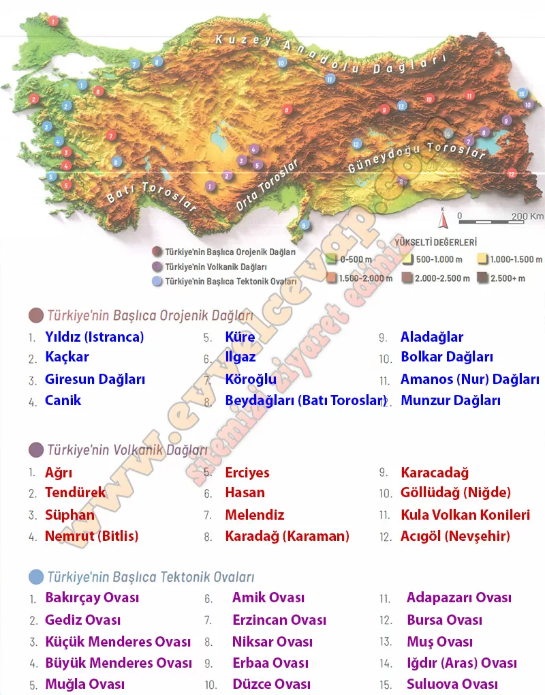

# 10. Sınıf Coğrafya Kitabı Cevapları Meb Yayınları Sayfa 61

---

**Uygulama**

**Soru: Haritada konumları numaralandırılarak gösterilen, tektonizma etkisiyle oluşmuş başlıca dağların ve ovaların isimlerini atlaslarınızdan yararlanarak boş bırakılan alana yazınız.**

-   **Cevap**:

