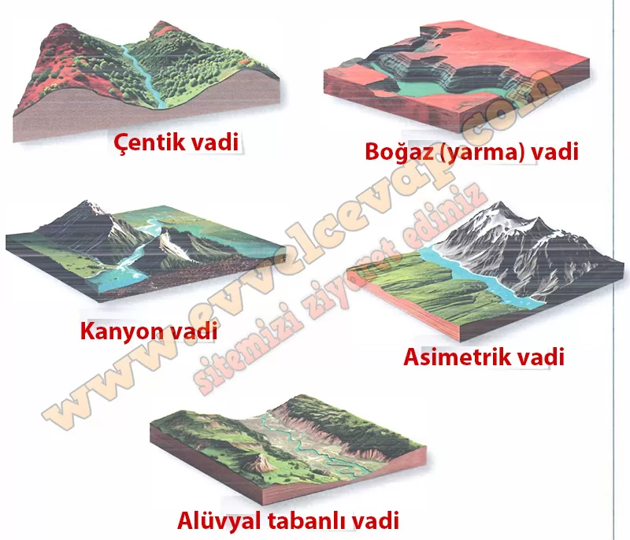

# 10. Sınıf Coğrafya Kitabı Cevapları Meb Yayınları Sayfa 82

---

Vadi Tipleri: Akarsuyun aşındırma gücüne, zemindeki kaya yapısına ve arazinin eğimine göre farklı vadi tipleri oluşur. Örneğin akarsuyun hızlı aktığı ve derine aşındırmanın etkili olduğu eğimli yamaçlarda V profilli, tabansız çentik vadiler oluşur. Akarsuların yükselen arazilerdeki dağ sıralarını enine yarıp geçmesiyle derin, dik yamaçlı ve U profilli boğaz (yarma) vadiler meydana gelir. Yatay tortul kaya tabakalarının bulunduğu arazilerde basamaklı yamaçları olan derin kanyon vadiler oluşur. İki yamacında aşınmaya karşı direnci farklı kaya türleri bulunan yerlerde yamaç eğimlerinin belirgin farklılık göstermesiyle asimetrik vadiler meydana gelir. Eğimin iyice azaldığı alanlarda ise alüvyal tabanlı vadiler oluşur.

**Uygulama**

**Soru: Akarsuyun aşındırma sürecinde kayaç özellikleri, iklim etkileri ve yeryüzü şekillerinin etkisine bağlı olarak oluşan akarsu vadi tiplerinin isimlerini görsellerdeki boş bırakılan alanlara yazınız.**

-   **Cevap**:

