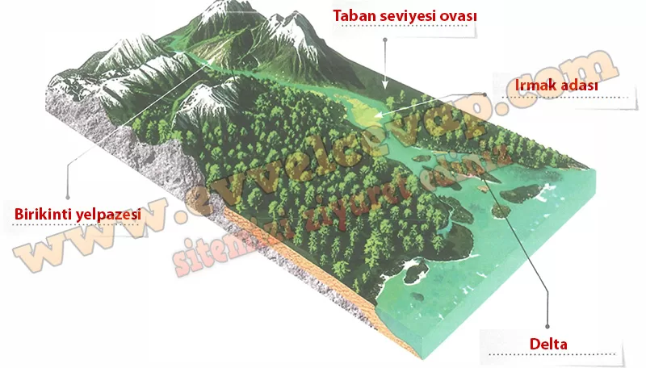

# 10. Sınıf Coğrafya Kitabı Cevapları Meb Yayınları Sayfa 83

---

Akarsuların Birikme Süreçlerindeki Rolü: Akarsular, taşıdığı alüvyonları eğimin azaldığı alanlarda biriktirerek çeşitli yer şekilleri oluşturur. Engebeli arazilerde yamaçlardan inen akarsuların taşıdığı alüvyonların bir kısmını yamaç eteğinde biriktirmesiyle birikinti konileri ve birikinti yelpazeleri meydana gelir. Akarsular, yatağını taban seviyesine yaklaştırdığı ve genişlettiği yerlerde biriktirmeler yaparak taban seviyesi ovası (taşkın ovası) meydana getirir.

Akarsular, taşıdığı alüvyonların bir kısmını kendi yatağında biriktirerek ırmak adalarını oluşturur. Akarsular, taşıdığı alüvyonların bir kısmını da denize veya göle döküldüğü yerde biriktirir. Kıyıda derinlik azsa ve biriktirmeyi önleyecek bir akıntı veya gelgit hareketi yoksa taşınan alüvyonlar akarsuyun döküldüğü yerde birikmeye başlar. Biriken alüvyonların denizi doldurmasıyla kıyıdan açığa doğru büyüyen, delta adı verilen düzlükler oluşur.

**Uygulama**

**Soru: Akarsuyun biriktirme süreci etkisine bağlı olarak oluşan akarsu biriktirme şekillerinin isimlerini görseldeki boş bırakılan alanlara yazınız.**

-   **Cevap**:

