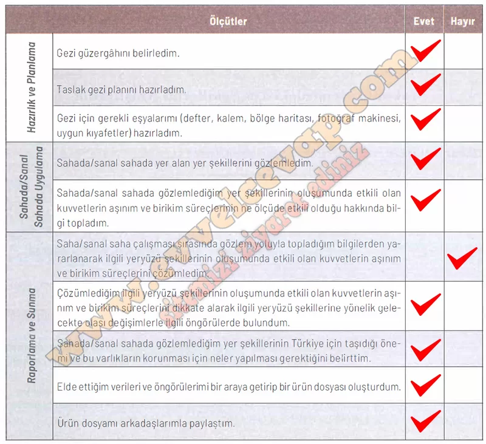

# 10. Sınıf Coğrafya Kitabı Cevapları Meb Yayınları Sayfa 98

---

**Soru: Saha/sanal saha çalışmasındaki performansınıza ilişkin değerlendirme yapmak amacıyla aşağıdaki maddeleri okuyunuz ve her maddeye ilişkin tablodaki ilgili yerleri işaretleyiniz. “Hayır” bölümündeki işaretleriniz birden fazlaysa öğretmeniniz yardımıyla eksik öğrenmelerinizi tamamlayınız.**

-   **Cevap**:

