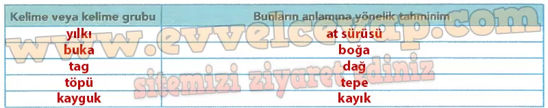
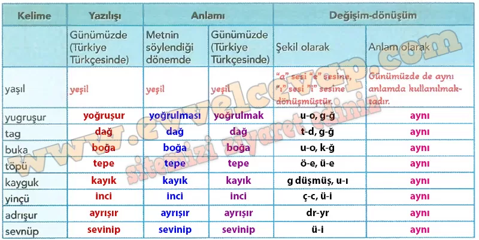
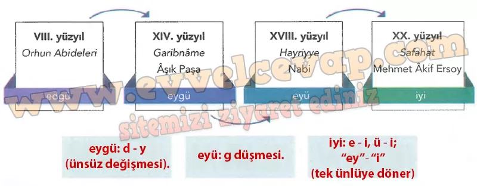

# 10. Sınıf Türk Dili ve Edebiyatı Ders Kitabı Meb Yayınları Cevapları Sayfa 19

---

**Soru: 1) Aşağıdaki tabloya okuduğunuz koşuğun orijinal metninde anlamım bilmediğiniz kelime veya kelime gruplarım, bunların anlamlarına dair tahminlerinizi yazınız.**

-   **Cevap**:

**Soru: 2) Okuduğunuz koşukta geçen kelimelerin zaman içinde şekil ve anlam yönünden nasıl bir değişim ve dönüşüm geçirdiğini ortaya koymak için aşağıdaki tabloyu inceleyerek boş bırakılan yerleri örnekteki gibi tamamlayınız.**

-   **Cevap**:

**Soru: 3) Aşağıdaki infografikte “iyi” sözcüğünün Türkçenin yazılı metinlerle takip edilebilen dönemlerindeki değişimi gösterilmiştir. İnfografikten hareketle “iyi” sözcüğünün günümüze kadar geçirdiği ses değişimlerini ilgili kutucuklara yazınız.**

-   **Cevap**:

