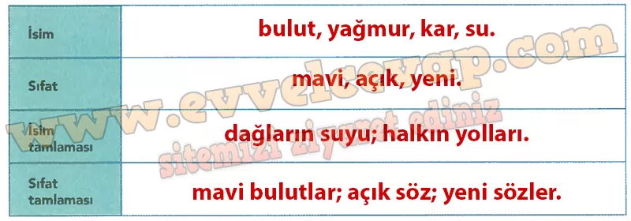

# 10. Sınıf Türk Dili ve Edebiyatı Ders Kitabı Meb Yayınları Cevapları Sayfa 29

---

**Soru: 1) Tahlil ettiğiniz koşuktan ve Lisan adlı şiirden alman aşağıdaki parçalardan tabloda istenen kelime ve kelime grubu çeşitlerini bularak ilgili alana yazınız.**

**GÜNÜMÜZ TÜRKÇESİYLE**

Döktü bulut yağmurunu,

 Gerip tutuyor ak torunu,

 Kırlara bıraktı karını,

 Seller akar, şarıldaşır.

Karlar buzlar hep eridi,

 Dağların suyu yürüdü,

 Mavi bulutlar belirdi,

 Kayıklar gibi kımıldaşır.

Kuydı bulut yagmurın,

 Kerip tutar ak torın,

 Kırka kodtı ol karın,

 Akın akar enreşür.

Kar büz kamug erüşdi,

 Taglar suvı akışdı,

 Kökşin bulıt örüşdi,

 Kayguk bolup ügrişür.

**LİSAN**

Açık sözle kalmalı

 Fikre ışık salmalı;

 Müteradif sözlerden

 Türkçesini almalı.

Yeni sözler gerekse

 Bunda da uy herkese;

 Halkın söz yaratmada

 Yollarını benimse.

-   **Cevap**:

**Soru: 2) İsim ve sıfatların, bunlarla kurulan tamlamaların metnin içeriğine, dil ve anlatımına katkısıyla ilgili görüşlerinizi arkadaşlarınızla paylaşınız.**

-   **Cevap**: İsimler doğa unsurlarını somutlaştırır, sıfatlar betimlemeyi ve duyguyu güçlendirir. İsim ve sıfat tamlamaları ayrıntıyı netleştirir, dili akıcı ve ahenkli kılar.