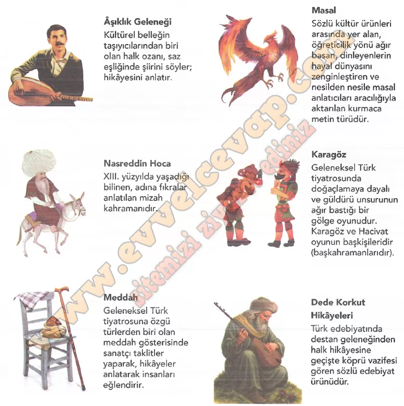

# 10. Sınıf Türk Dili ve Edebiyatı Ders Kitabı Meb Yayınları Cevapları Sayfa 34

---

**Soru: Aşağıda sözlü kültür ürünü örneklerinin yer aldığı infografik verilmiştir. İnfografikten faydalanarak soruları cevaplayınız.**

**Soru: 1) Sözlü kültür ürünlerinin toplum ve birey üzerindeki etkileri hakkındaki düşüncelerinizi arkadaşlarınızla paylaşınız.**

-   **Cevap**: Sözlü kültür ürünleri dili, ahlakı ve ortak değerleri aktarır; insanı eğlendirirken düşündürür, hayal gücünü geliştirir. Toplumda birlik ve aidiyet duygusu oluşturur.

**Soru: 2) Bir toplumun hafızasını oluşturan sözlü kültür ürünlerinin korunmasının millî kimliğin sürekliliğine katkısı nelerdir? Yazınız.**

-   **Cevap**: Korununca bu ürünler nesilden nesile aktarılır, dil ve kültür canlı kalır. Millî kimlik güçlenir, ortak tarih ve değerler süreklilik kazanır.