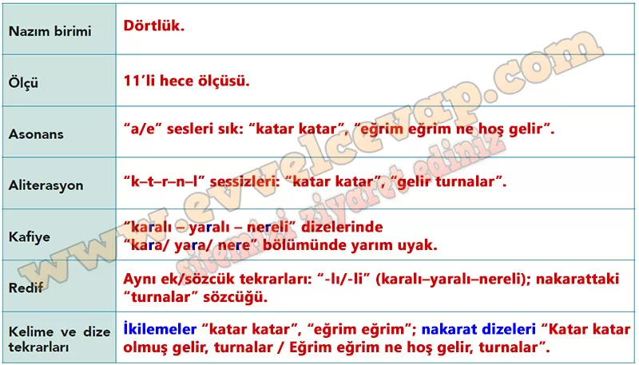

# 10. Sınıf Türk Dili ve Edebiyatı Ders Kitabı Meb Yayınları Cevapları Sayfa 45

---

**Sıra Sizde**

**Soru: Turnalar türküsünün tabloda verilen ahenk özelliklerini belirleyerek ilgili kavramların karşısına yazınız.**

-   **Cevap**:

**TURNALAR**

İki turnam gelir aklı karalı

 Birin şahin vurmuş, biri yaralı

 O yavruya sorun aslı nereli

Katar katar olmuş gelir, turnalar

 Eğrim eğrim ne hoş gelir, turnalar

İnme turnam inme sen bu pınara

 Avcu tuzak kurmuş, var yolun ara

 Hepimizin işi Mevlâm onara

Katar katar olmuş gelir, turnalar

 Eğrim eğrim ne hoş gelir, turnalar

İnme turnam inme, yolda kış olur

 Bastığın yerler de donar taş olur

 Böyle kalmaz elbet sonu hoş olur

Katar katar olmuş gelir, turnalar

 Eğrim eğrim ne hoş gelir, turnalar

İnme turnam inme, haber sorayım

 Kanadın altına nâme sarayım

 Nazlı sevdiğimden haber alayım

Katar katar olmuş gelir, turnalar

 Eğrim eğrim ne hoş gelir, turnalar

Anonim

**Dilimizin İncelikleri**

**Soru: Turnalar türküsünün konusundan yola çıkarak türkünün içeriğine uygun kısa bir hikâye yazınız. Hikâyenin başkahramanım ve turnaları betimleyiniz. Betimleme yaparken hangi sözcük türünü sıklıkla kullandığınızı gerekçesiyle açıklayınız.**

-   **Cevap**:

**HİKÂYE**

Kış akşamıydı. Başkahramanım Elif, köyün dışındaki pınarın başında bekliyordu. Gökyüzünde katar katar dönen turnalar göründü. Turnaların uzun boyunları, ince bacakları ve gümüş renkli tüyleri ay ışığında parlıyordu. En önde uçan yaşlı turnanın kanadı hafifçe yaralıydı; yine de sürüsünü sakince yönlendiriyordu. Elif, avcı tuzaklarını görünce fısıldadı: “İnme turnam, yolda kış var.” Cebinden küçük bir kâğıt çıkardı, kırmızı iplikle bir turnanın kanadının altına nazikçe iliştirdi. Mektupta, “Nazlı sevdiğimden haber verin,” yazıyordu. Sürünün eğri çizgilerle uzaklaşmasını izlerken içi umutla doldu. “Böyle kalmaz, sonu hoş olur,” dedi.

**Betimleme Açıklaması**:

Betimlemede **sıfatları** sık kullandım (ör. “uzun boyunlu”, “ince bacaklı”, “gümüş renkli”, “yaralı”). Çünkü sıfatlar varlıkların özelliklerini belirtir, görüntüyü somutlaştırır ve okurun zihninde canlı bir sahne oluşturur.