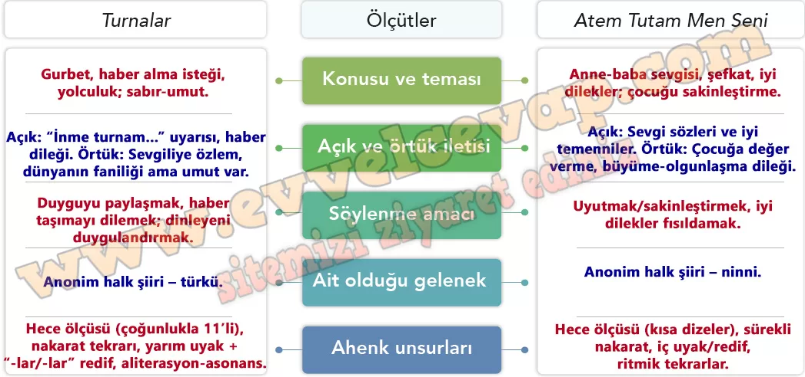

# 10. Sınıf Türk Dili ve Edebiyatı Ders Kitabı Meb Yayınları Cevapları Sayfa 46

---

**Karşılaştıralım**

**Soru: 1) Turnalar türküsüyle Atem Tutam Men Seni adlı ninniyi tabloda verilen ölçütlere göre karşılaştırınız. Bu şiirlerin benzer ve farklı yönlerini tespit ediniz. Bu tespitleri yaparken nasıl bir yol izlediğinizi gerekçeleriyle açıklayınız.**

-   **Cevap**: Önce metinleri ölçüt başlıklarına göre okuyup tür ve işlevlerini belirledim. Ardından tema/ileti ile amacı ayırdım, türkü–ninni farkını gelenek içinde konumladım. Son olarak tekrar, uyak, redif ve ölçü gibi ahenk öğelerini inceleyip benzerlik–farkları bunlara dayandırdım.

**ATEM TUTAM MEN SENİ**

Atem tutam men seni

 Şekere gatem men seni

 Akşem baben gelende (oy)

 Öğüne atem men seni

Hop hopun olsun oğlum

 Gül topun olsun oğlum

 Sıralı gavak dibinde (oy)

 Toyluğun olsun oğlum (oy)

Atem tutam men seni

 Şekere gatem men seni

 Akşem baben gelende (oy)

 Öğüne atem men seni

Ev süpürür toz eder

 Hamama gider naz eder

 El ayağı kir içinde

 Yıkamam diye naz eder

Atem tutam men seni

 Şekere gatem men seni

 Akşem baben gelende (oy)

 Öğüne atem men seni

**Soru: 2) Türkü ve ninni metinlerinin yapı unsurlarına yönelik çıkarımlarınızdan hareketle bu unsurların içeriğe katkısıyla ilgili düşüncelerinizi söyleyiniz.**

-   **Cevap**: Dörtlük, hece ve nakarat duyguyu güçlendirir. Türküde özlem ve uyarı akış kazanır; ninnide ritim ve tekrar huzur verip uyutmayı kolaylaştırır.

**Soru: 3) Turnalar türküsünün ve Atem Tutam Men Seni adlı ninninin içeriğini nasıl bir görselle yansıtmak isterdiniz? Gerekçelendirerek açıklayınız.**

-   **Cevap**:

“**Turnalar**”: Kış ufkunda pınar üstünde katar uçan turnalar, kanat altında küçük mektup.

“**Atem Tutam Men Seni**”: Loş odada beşik başında anne, yumuşak çizgiler ve nakaratı çağrıştıran sakin ritim.