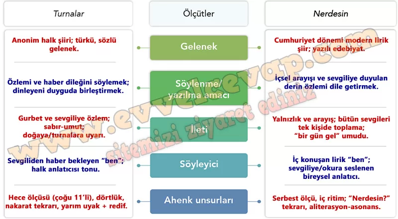

# 10. Sınıf Türk Dili ve Edebiyatı Ders Kitabı Meb Yayınları Cevapları Sayfa 50

---

**Karşılaştıralım**

**Soru: 1) Turnalar adlı türküyle aşağıdaki şiiri verilen ölçütlere göre karşılaştırınız.**

**NERDESİN**

Geceleyin bir ses böler uykumu,

 İçim ürpermeyle dolar:

 — Nerdesin? Arıyorum yıllar var ki ben onu,

 Âşıkıyım beni çağran bu sesin.

Gün olur sürüyüp beni derbeder,

 Bu ses rüzgârlara karışır gider.

 Gün olur peşimden yürür beraber,

 Ansızın haykırır bana: — Nerdesin?

Bütün sevgileri atıp içimden,

 Varlığımı yalnız ona verdim ben,

 Elverir ki bir gün bana derinden,

 Ta derinden bir gün bana “Gel” desin.

**Soru: 1) Turnalar adlı türkünün hangi disiplinlerle ilişkilendirilebileceğini türküden örnekler vererek açıklayınız.**

-   **Cevap**: **Biyoloji ve coğrafya**: turnaların göçü, “katar katar” sürü davranışı ve “yolda kış olur” mevsim etkisi. **Din/kültür ve dil-edebiyat**: “Mevlâm onara” duası, hece-uyak-nakarat. **Müzik ve çevre/sosyal bilgiler**: türkü formu, **ritim**; “avcu tuzak kurmuş” uyarısıyla **yaban hayatı ve gelenek**.

**Soru: 2) Turnalar türküsünde işlenen konu hangi sanat dallarıyla ele alınabilir? Yazınız.**

-   **Cevap**: **Müzik**: bağlama/çok sesli koro düzenlemesi. **Görsel sanatlar ve performans**: göç eden turnalar resmi, turnadan esinli **dans**; tiyatroda mektup-haber sahnesi. **Sinema/edebiyat**: kısa film ve öykü/şiir uyarlaması.