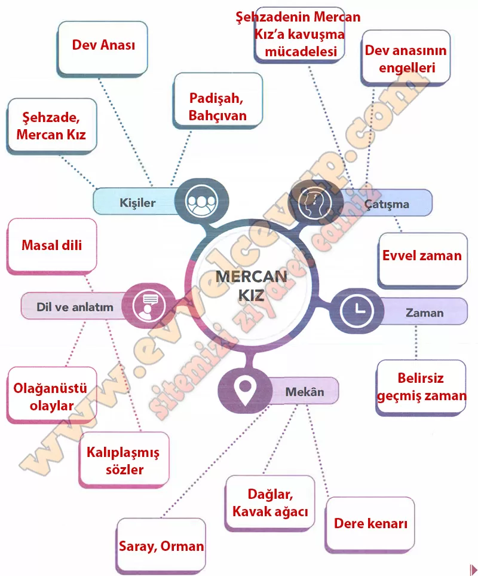

# 10. Sınıf Türk Dili ve Edebiyatı Ders Kitabı Meb Yayınları Cevapları Sayfa 70

---

**Birlikte Öğrenelim**

**Soru: Aşağıdaki zihin haritasında boş bırakılan kutucuklara uygun kelimeleri yazınız.**

-   **Cevap**:

