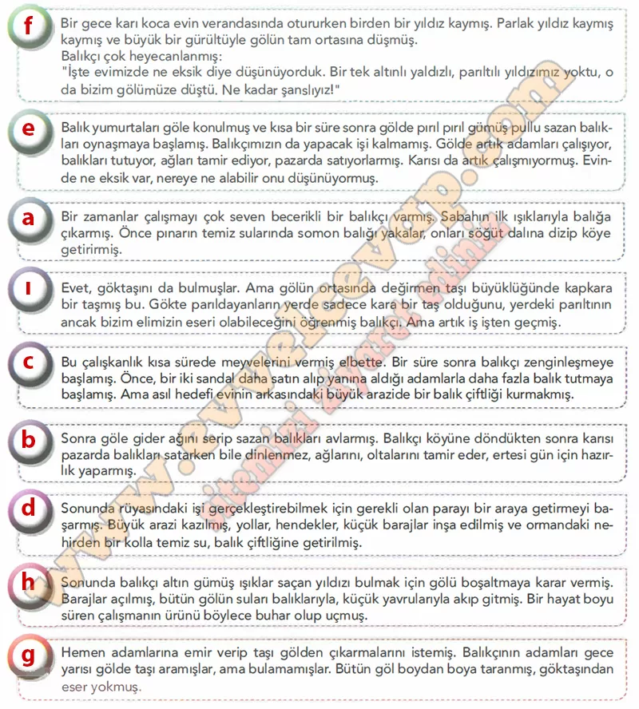

# 10. Sınıf Türk Dili ve Edebiyatı Ders Kitabı Meb Yayınları Cevapları Sayfa 75

---

**Soru: 1) Aşağıda bir masal metni bölümlere ayrılarak karışık biçimde verilmiştir. Bu parçaları anlamlı bir bütün oluşturacak şekilde harflendirerek sıralayınız.**

-   **Cevap**:

