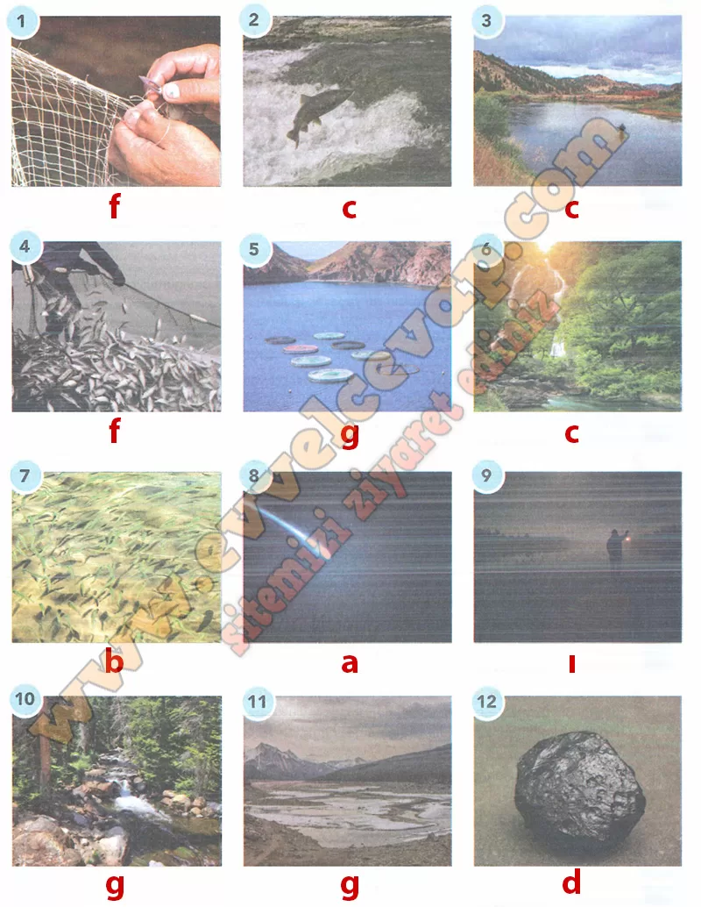

# 10. Sınıf Türk Dili ve Edebiyatı Ders Kitabı Meb Yayınları Cevapları Sayfa 76

---

**Soru: 2) Masalın her parçası için bir görsel kullanmanız istenseydi aşağıdaki görselleri hangi parçalar için kullanırdınız? Görsellerin altlarındaki boşluklara parçaların başındaki harfleri yazınız (Bir parça için birden fazla görsel seçebilirsiniz.).**

-   **Cevap**:

