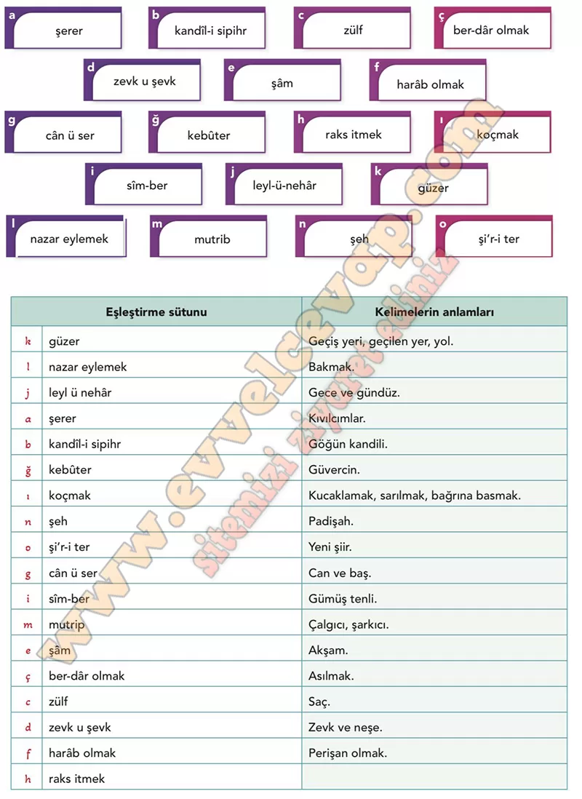

# 10. Sınıf Türk Dili ve Edebiyatı Ders Kitabı Meb Yayınları Cevapları Sayfa 93

---

**Söz Varlığım**

**Soru: Gazelde geçen bazı kelime ve kelime gruplan ile bunların anlamlan aşağıda verilmiştir. Dizelerdeki bağlamından hareketle bu kelime ve kelime grupları anlamlarıyla eşleştiriniz. Yaptığınız eşleştirmenin doğru olup olmadığını tablonun yanındaki karekoddan kontrol ediniz.**

-   **Cevap**:

