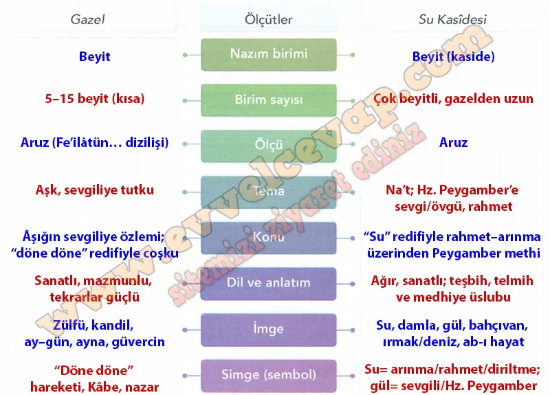

# 10. Sınıf Türk Dili ve Edebiyatı Ders Kitabı Meb Yayınları Cevapları Sayfa 96

---

24. Zerre zerre hâk-i dergâhına ister sala nûr Dönmez ol dergâhdan ger olsa pare pare su (…)

 30. Yümn-i na’tünden güher olmış Fuzûlî sözleri Ebr-i nîsândan dönen tek lü’lü-i şeh-vâra su

 31. Hâb-ı gafletden olan bîdâr olanda rûz-ı haşr Eşk-i hasretden tökende dîde-i bîdâra su

 32. Umduğum oldur ki rûz-ı haşr mahrûm olmayam Çeşme-i vaslun vire men teşne-i dîdâra su

 Ölçü: Fâ’ilâtün/Fâilâtün/Fâilâtün/Fâilün

24. Su# zerre zerre [Hz. Peygamberin] dergâhının toprağına nur salmak/götürmek ister. Eğer parça parça olsa bile o dergâhtan dönmez. (…)

 30. Suyun nisan yağmurunda şahlara layık iri inciye dönüşmesi gibi Fuzûlî’nin sözleri de [Hz. Peygamberin] bereketli/uğurlu methiyle inciye dönüştü.

 31. Mahşer günü olduğunda, gaflet uykusundan uyanan; hasret gözyaşından, uyanık gözlere su döktüğünde [/ağladığında]…

 32. Umduğum odur ki [senin] kavuşma çeşmen, ben [senin] güzel yüzüne susamış olana su vere, mahşer günü mahrum kalmayam.

-   **Cevap**:

