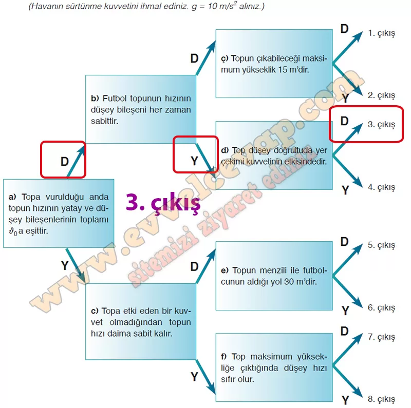

# 10. Sınıf Fizik Ders Kitabı Meb Yayınları Cevapları Sayfa 101

---

**Soru: ç) Aşağıda verilen tanılayıcı dallanmış ağaçtaki ifadelerin doğru olduğunu düşünüyorsanız “D”, yanlış olduğunu düşünüyorsanız “Y” harfinin yazılı olduğu yönlendirici okları takip ediniz. İlk ifadeden başlayarak yapacağınız seçimlerle oklar yönünde ilerleyiniz ve sekiz farklı çıkış noktasından birine ulaşınız.**

-   **Cevap**:

**Soru: d) İki boyutta sabit ivmeli harekete yönelik en az iki genellemeyi kendi cümleleriniz ile yazınız.**

-   **Cevap**:

• İki boyutta sabit ivmeli harekette toplar yer çekimi kuvvetinin etkisinde hareket eder.

 • Toplar maksimum yüksekliğe çıktığında düşey hızları sıfır olur.

 • İki boyutta sabit ivmeli harekette topun harekete başladığı andaki hızının yatay ve düşey bileşenlerinin toplamı c0 a eşittir.

 • İki boyutta sabit ivmeli harekette topa yatay doğrultuda etki eden bir kuvvet olmadığı için topun yatay hızı her zaman sabit kalır.