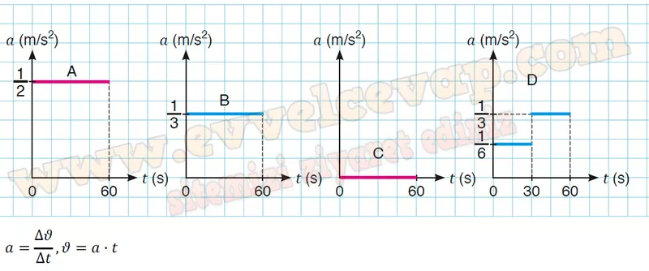
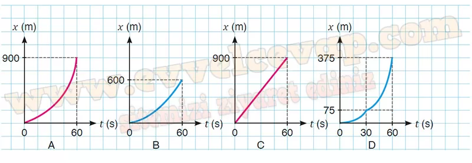

# 10. Sınıf Fizik Ders Kitabı Meb Yayınları Cevapları Sayfa 103

---

**Soru: 8) Bir otoyolun gişelerinden geçerken = 0 anında yan yana olan A, B, C ve D araçlarının ilk 60 s’deki grafikleri verilmektedir. Buna göre;**

**Soru: a) Araçların ν-t grafiklerini inceleyerek 30. s’deki hızlarını hesaplayınız.**

-   **Cevap**: V A = 15 m/s, V B = 10 m/s, V c = 15 m/s, V D = 5 m/s

**Soru: b) Araçların ν-t grafiklerinden yararlanarak a-t grafiklerini çiziniz. İvme ve hız kavramlarına ait matematiksel modelleri yazınız.**

-   **Cevap**:

**Soru: c) Araçların (0-60) s aralığındaki yer değiştirme büyüklüklerini hesaplayarak hangi araçların tekrar yan yana konumlarda bulunabileceğini yazınız.**

-   **Cevap**:

𝑥 A = 900 m, 𝑥 B = 600 m, 𝑥 C = 900 m, 𝑥 D = 375 m

 A ve C araçları yan yana olur.

**Soru: ç) Araçların ν-t grafiklerinden yararlanarak x-t grafiklerini çiziniz.**

-   **Cevap**:

