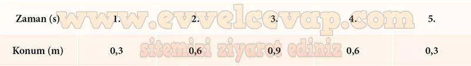
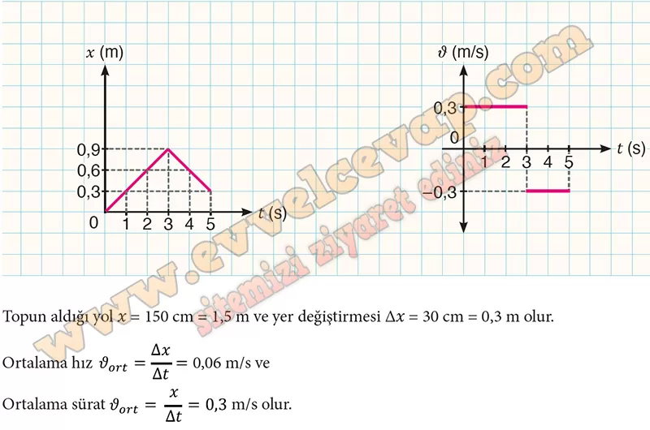
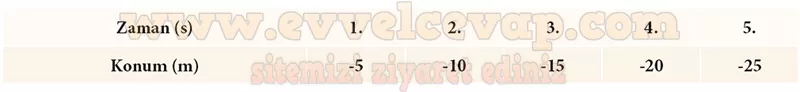
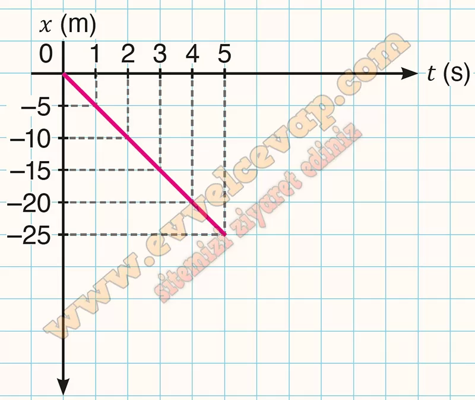

# 10. Sınıf Fizik Ders Kitabı Meb Yayınları Cevapları Sayfa 19

---

**Soru: 8) Yatay doğrultuda sabit hızla hareket eden cisimler için konum, yer değiştirme, hız ve zaman değişkenlerine ilişkin genellemeleri kendi cümlelerinizle ifade ediniz.**

-   **Cevap**: Yatay doğrultuda sabit hızla hareket eden cisimlerin

• her bir zaman aralığındaki konumları eşittir. Konum referans noktasına göre artar.

 • eşit zaman aralıklarındaki yer değiştirmeleri eşittir.

 • her bir zaman aralığındaki hız büyüklükleri eşittir.

**Soru: 9) Yandaki karekodu kullanarak animasyonu açınız ve topun hareketini inceleyiniz. (Topun hareketi esnasında sürtünmeler ve enerji kayıpları ihmal edilmiştir.)**

-   **Cevap**: Animasyonu açtık ve topun sürtünme ile enerji kaybı olmadan hareket ettiğini gözlemledik.

**Soru: 10) Topun (0-5) s zaman aralığında bulunduğu konumları tabloya yazınız.**

-   **Cevap**:

**Soru: 11) Tablodaki verileri kullanarak topun x-t ve û-t grafiklerini çiziniz. Her iki grafikten yararlanarak topun aldığı yolu ve yer değiştirme büyüklüğünü hesaplayınız. Bu değerleri kullanarak topun ortalama süratini ve ortalama hızının büyüklüğünü bulunuz.**

-   **Cevap**:

**Değerlendirme**

**Soru: 1) a) 2. adımdaki simülasyonu açarak “Aracın hızı” ayar düğmesini sola doğru sürükleyiniz ve hızın büyüklüğünü -5 m/s’ye getiriniz. “BAŞLAT” butonuna tıklayarak aracın zamana bağlı olarak değişen konumlarını aşağıdaki tabloya yazınız.**

-   **Cevap**:

**Soru: b) Tablodaki verilerden yararlanarak aracın x-t grafiğini çiziniz.**

-   **Cevap**:

