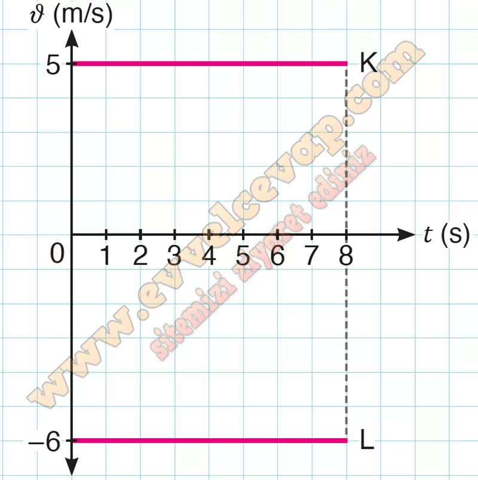
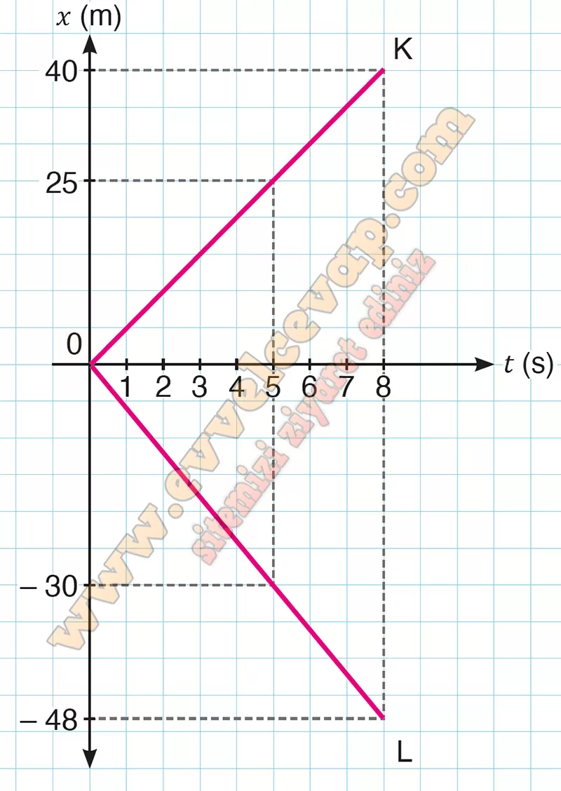

# 10. Sınıf Fizik Ders Kitabı Meb Yayınları Cevapları Sayfa 22

---

**1.1 Soru**

**Soru: Doğrusal bir parkurda birbirine doğru sabit hızlarla hareket eden K ve L bisikletlilerinin hareketi görseldeki gibidir. Bisikletlilerin hız büyüklükleri sırasıyla 5 m/s ve 6 m/s’dir. K ve L bisikletlileri t= 0 anında görseldeki gibi karşılaştıklarına göre**

**Soru: a) Bisikletlilerin 5 s’lik hareketine ait ν-t grafiğini çiziniz.**

-   **Cevap**:

**Soru: b) Bisikletlilerin 8. s’de aralarındaki uzaklık kaç m olur?**

-   **Cevap**: 𝑥 = 88 m

**Soru: c) Bisikletlilerin 8 s’lik hareketine ait x-t grafiğini çiziniz,**

-   **Cevap**:

**Soru: ç) bisikletlisinin 5 s’de aldığı yolu K bisikletlisi kaç s’de alır?**

-   **Cevap**: t = 6 s