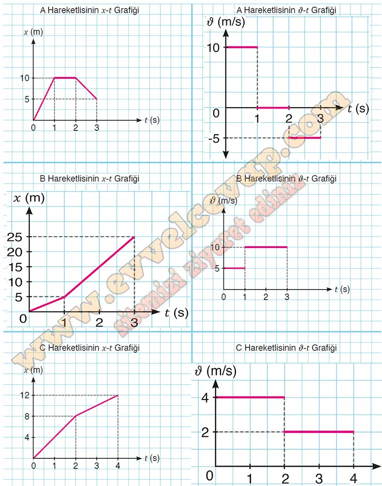

# 10. Sınıf Fizik Ders Kitabı Meb Yayınları Cevapları Sayfa 27

---

**1.6 Soru**

**Soru: Aşağıdaki tabloda A, B, C hareketlilerinin x-t ve ν-t grafikleri verilmiştir. x-t grafiğinden yararlanarak hareketliye ait grafiğini, grafiğinden yararlanarak x-t grafiğini yanında boş bırakılan grafik alanına çiziniz.**

-   **Cevap**:

