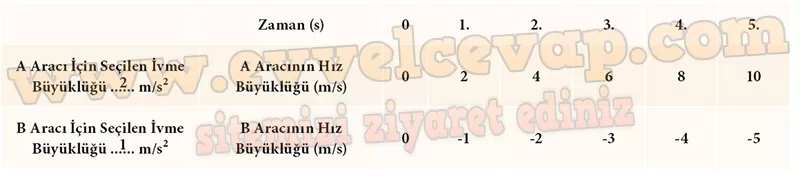

# 10. Sınıf Fizik Ders Kitabı Meb Yayınları Cevapları Sayfa 45

---

**Soru: 4) BAŞLAT” butonuna tıklayarak araçların yatay doğrultudaki hareketini (pozitif ve negatif yönde hızlanan hareket) inceleyiniz. Aşağıdaki Tablo f e A ve B araçları için belirlediğiniz ivmelerin büyüklüklerini ve araçların tabloda belirtilen zamanlardaki hız büyüklüklerini yazınız.**

-   **Cevap**:

**Soru: 5) Tablo 1′ deki değerlerden yararlanarak zıt yönlerde hızlanarak hareket eden A ve B araçlarına ait û-t grafiklerini ilgili alana çiziniz. Çizdiğiniz grafikleri karşılaştırınız ve karşılaştırmaya ilişkin yorumlarınızı verilen alana yazınız.**

-   **Cevap**: A ve B araçları ters yönlerde hızlanarak hareket etmektedir. A aracının yönü pozitif kabul edilirse B aracı negatif yönde ilerlemektedir. Bu nedenle A aracına ait c-t grafiği yatay eksenin üstünde (pozitif yön), B aracına ait c-t grafiği yatay eksenin altında (negatif yön) yer alır.

**Soru: 6) ν-1 grafiğinden yararlanarak hız ve konum arasındaki ilişkiyi ifade ediniz.**

-   **Cevap**:

