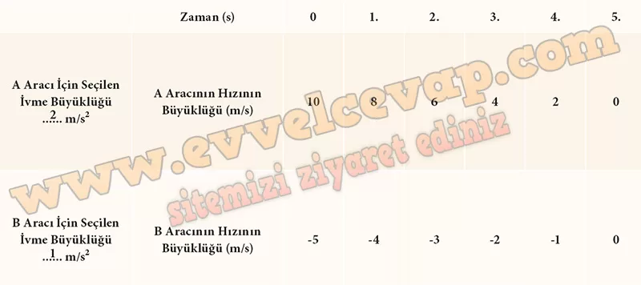
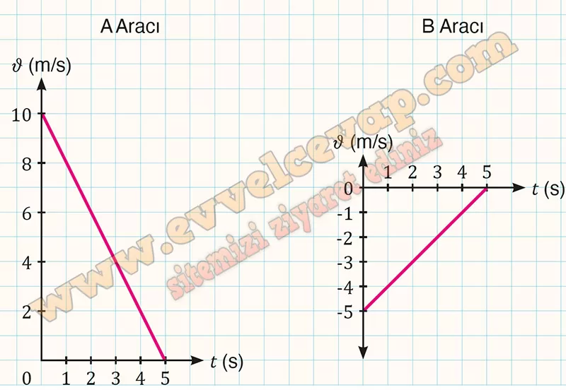

# 10. Sınıf Fizik Ders Kitabı Meb Yayınları Cevapları Sayfa 46

---

**Soru: 7) Simülasyon ekranındaki “SIFIRLA” butonuna basınız. Karşınıza çıkan ekranda “Yavaşlayan hareket” butonuna tıklayınız.**

-   **Cevap**: “SIFIRLA” butonuna bastık ve ardından “Yavaşlayan hareket” butonuna tıkladık.

**Soru: 8) Simülasyon ekranının üst bölümünde yer alan “A aracının ivme değeri” ve “B aracının ivme değeri” göstergelerinin ayar düğmesini sağa doğru sürükleyerek A ve B araçlarının ivme büyüklüklerini belirleyiniz.**

-   **Cevap**: A ve B araçlarının ivme değerlerini ayar düğmelerini sağa kaydırarak belirledik.

**Soru: 9) “A aracının ilk hızı” ve “B aracının ilk hızı” göstergelerinin ayar düğmesini sağa doğru sürükleyerek A ve B araçlarının ilk hızlarının büyüklüklerini belirleyiniz.**

-   **Cevap**: A ve B araçlarının ilk hızlarını ayar düğmelerini sağa sürükleyerek seçtik.

**Soru: 10) Ekranda beliren “Başlat” butonuna tıklayarak araçların yatay doğrultudaki hareketini inceleyiniz. Tablo 2’ye A ve B araçları için belirlediğiniz ivme büyüklüklerini ve araçların tabloda belirtilen zamanlardaki hız büyüklüklerini yazınız.**

-   **Cevap**:

**Soru: 11) Tablo 2’deki değerlerden yararlanarak ters yönlerde yavaşlayan A ve B araçlarına ait û-t grafiklerini ilgili alana çiziniz. Grafikleri karşılaştırarak verilen alana yorumlarınızı yazınız.**

-   **Cevap**: A ve B araçları ters yönlerde yavaşlayarak hareket etmektedir. A aracının yönü pozitif kabul edilirse B aracı negatif yönde ilerlemektedir. Bu nedenle A aracına ait c-t grafiği yatay eksenin üstünde (pozitif yön), B aracına ait c-t grafiği yatay eksenin altında (negatif yön) yer alır.

