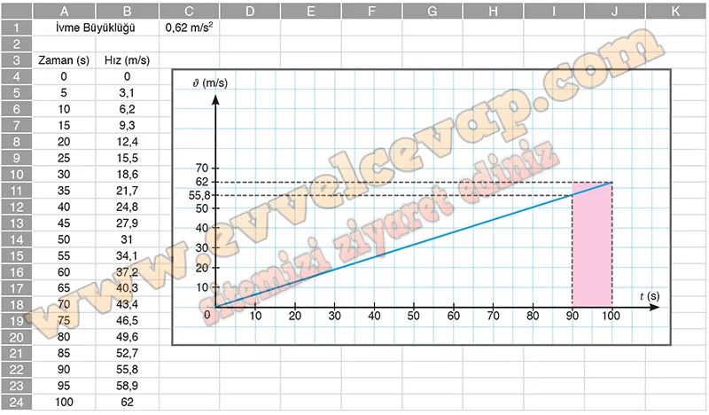

# 10. Sınıf Fizik Ders Kitabı Meb Yayınları Cevapları Sayfa 54

---

**1.12 Soru**

**Soru: İstanbul-Ankara arasında sefer yapan bir yüksek hızlı tren (YHT), Eskişehir İstasyonu’nda durup yolcu indirme ve bindirme işlemini tamamladıktan sonra tekrar harekete başlamaktadır. Tren, yatay doğrultuda belli bir mesafeyi 0,62 m/s2lik sabit ivme ile gitmektedir. Bu harekete ait veriler kullanılarak trenin â-t grafiği bir bilgisayar programı yardımıyla şekildeki gibi çizilmiştir. Buna göre yüksek hızlı trenin;**

**Soru: a) 100 s’de aldığı yol kaç m olur?**

-   **Cevap**: x = 3100 m

**Soru: b) Grafik doğrusu üzerindeki herhangi iki noktadan eğimi hesaplayınız ve elde ettiğiniz eğim değerini ivme değeri ile karşılaştırınız.**

-   **Cevap**: a = 0,62 m/s 2 sabit ivmeli hareket olduğu için her iki zaman aralığında da aynıdır.

**Soru: c) (90-100) s zaman aralığında yapmış olduğu yer değiştirmeyi grafik üzerinde gösteriniz.**

-   **Cevap**:

**Soru: ç) Hareketi boyunca ortalama hızının büyüklüğünü hesaplayınız.**

-   **Cevap**:

