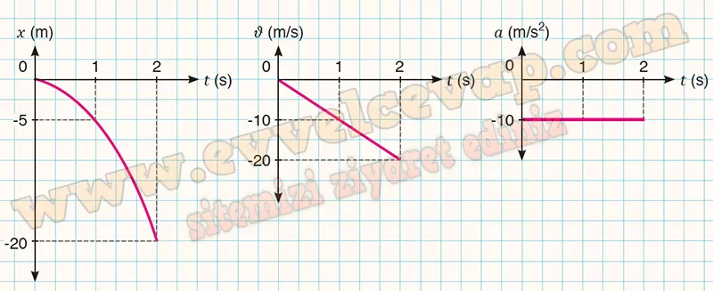

# 10. Sınıf Fizik Ders Kitabı Meb Yayınları Cevapları Sayfa 70

---

**Soru: 2) Topunu evde unutan Ali, arkadaşı Feryal’e seslenerek onun topunu ödünç ister. Yerden 20 m yükseklikteki katta oturan Feryal, elindeki topu ilk hızı sıfır olacak şekilde serbest bırakır. Buna göre;**

**Soru: a) Top kaç s’de yere çarpar?**

-   **Cevap**: t = 2 s

**Soru: b) Topun yere çarpma hızı nedir?**

-   **Cevap**: V= 20 m/s

**Soru: c) Topun x-t, ν-t ve a-t grafiklerini çiziniz.**

-   **Cevap**:

