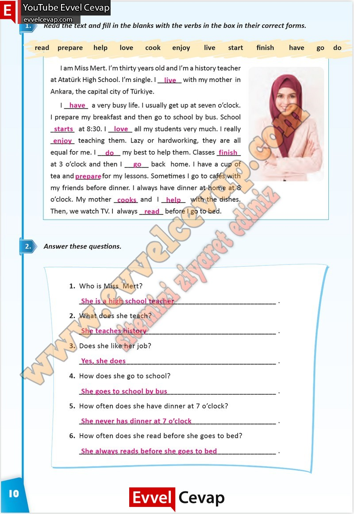

# 10. Sınıf İngilizce Çalışma Kitabı Cevapları Pasifik Yayınları Sayfa 10

---

**Soru: Read the text and fill in the blanks with the verbs in the box in their correct forms.**

**Soru: Answer these questions.**

**Soru: Who is Miss Mert?**

**Soru: What does she teach?**

**Soru: Does she like her job?**

**Soru: How does she go to school?**

**Soru: How often does she have dinner at 7 o’clock?**

**Soru: How often does she read before she goes to bed?**

-   **Cevap**:

