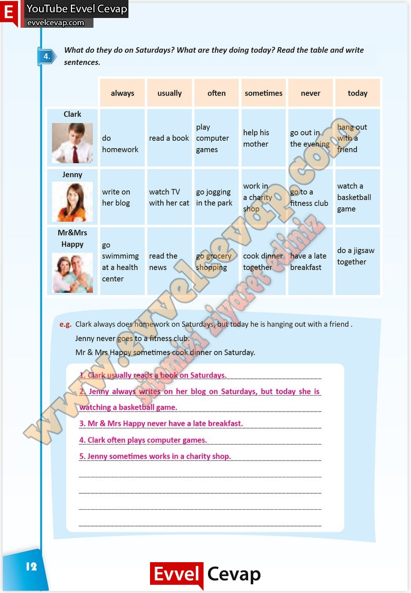

# 10. Sınıf İngilizce Çalışma Kitabı Cevapları Pasifik Yayınları Sayfa 12

---

**Soru: What do they do on Saturdays? What are they doing today? Read the table and write sentences.**

-   **Cevap**:

