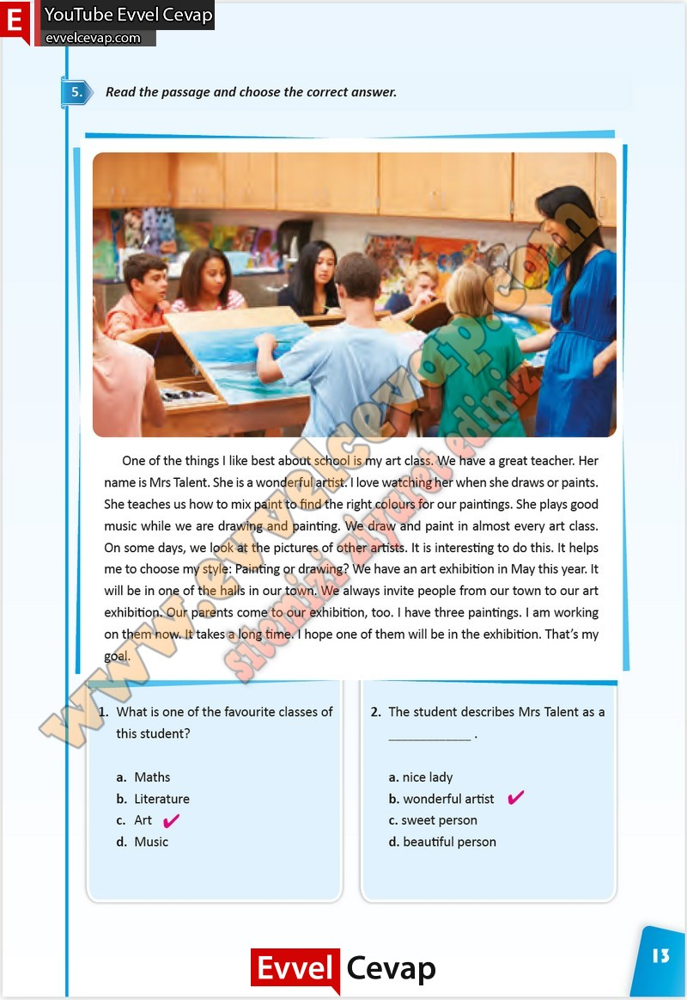

# 10. Sınıf İngilizce Çalışma Kitabı Cevapları Pasifik Yayınları Sayfa 13

---

**Soru: Read the passage and choose the correct answer.**

**Soru: What is one of the favourite classes of this student?**

a. Maths

 b. Literature

 c. Art

 d. Music

**Soru: The student describes Mrs Talent as a**

a. nice lady

 b. wonderful artist

 c. sweet person

 d. beautiful person

-   **Cevap**:

