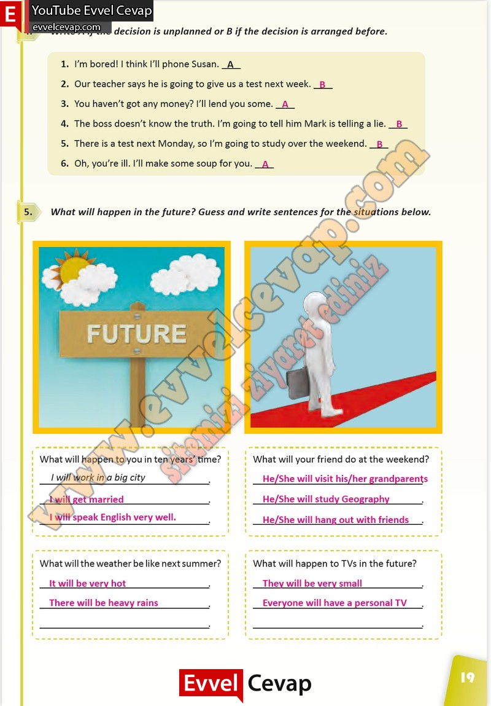

# 10. Sınıf İngilizce Çalışma Kitabı Cevapları Pasifik Yayınları Sayfa 19

---

**Soru: Write A if the decision is unplanned or B if the decision is arranged be fore.**

**Soru: What will happen in the future? Guess and wri te sentences for the situations below.**

**Soru: What will happen to you in ten years’ time?**

**Soru: What will your friend do at the weekend?**

**Soru: What will the weather be like next summer?**

**Soru: What will happen to TVs in the future?**

-   **Cevap**:

