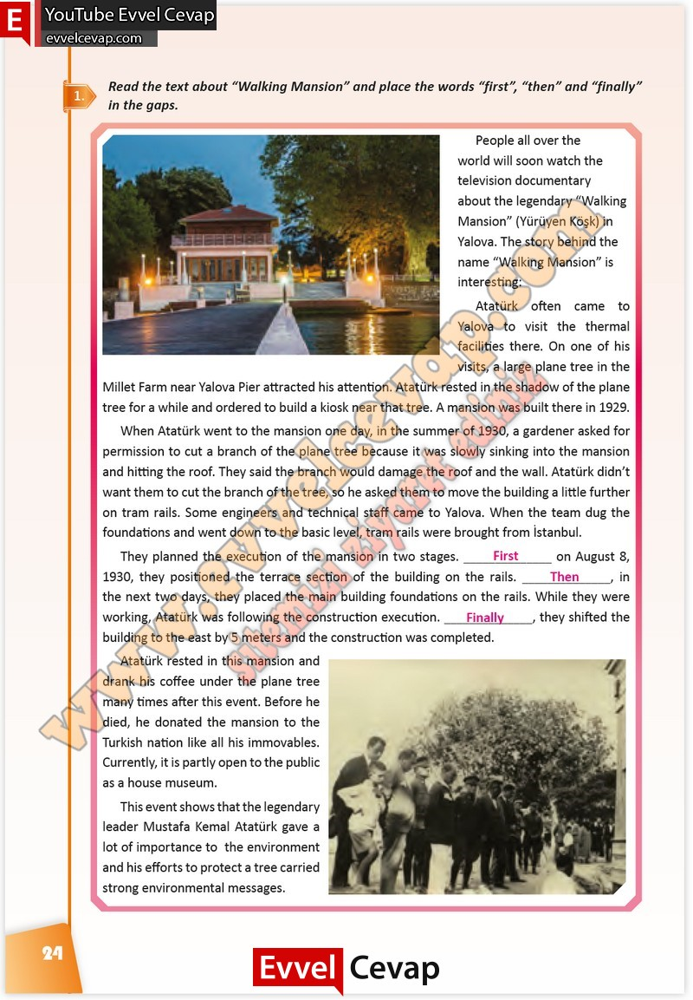

# 10. Sınıf İngilizce Çalışma Kitabı Cevapları Pasifik Yayınları Sayfa 24

---

**Soru: Read the text about “Walking Mansion” and place the words “first”, “then” and “finally ” in the gaps.**

-   **Cevap**:

