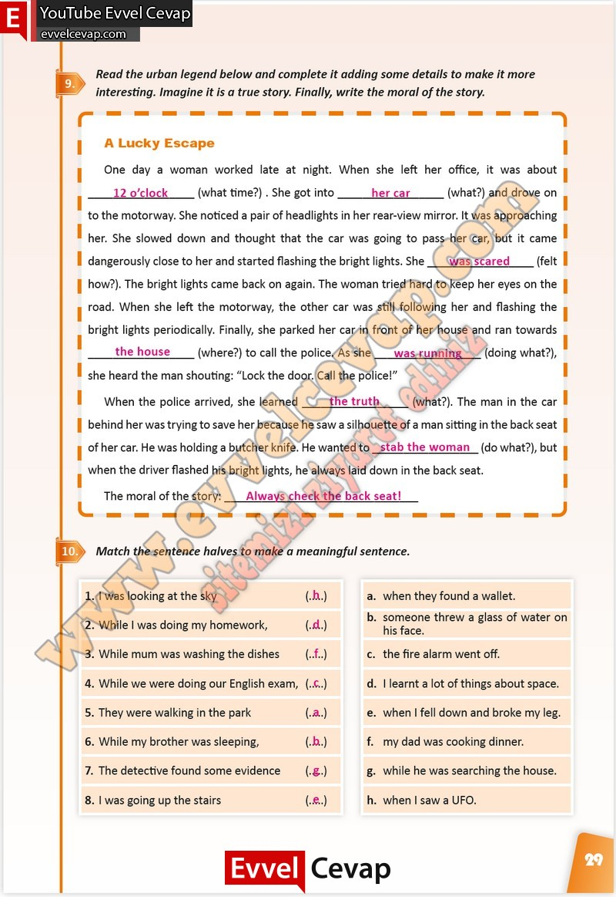

# 10. Sınıf İngilizce Çalışma Kitabı Cevapları Pasifik Yayınları Sayfa 29

---

**Soru: Read the urban legend below and complete it adding some details to make it more interesting. Imagine it is a true story. Finally, write the moral of the story.**

**Soru: Match the sentence halves to make a meaningful sentence.**

-   **Cevap**:

