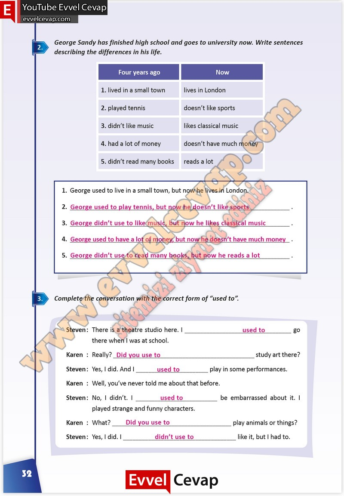

# 10. Sınıf İngilizce Çalışma Kitabı Cevapları Pasifik Yayınları Sayfa 32

---

**Soru: George Sandy has finished high school and goes to university now. Write sentences describing the differences in his life.**

**Soru: George used to live in a small town, but now he lives in London.**

**Soru: Complete the conversation with the correct form of “used to’‘**

-   **Cevap**:

