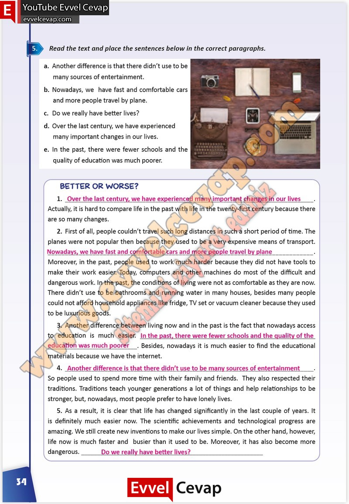

# 10. Sınıf İngilizce Çalışma Kitabı Cevapları Pasifik Yayınları Sayfa 34

---

**Soru: Read the text and place the sentences below in the correct paragraphs.**

a. Another difference is that there didn’t use to be many sources of entertainment.

 b. Nowadays, we have fast and comfortable cars and more people travel by plane.

 c. Do we really have better lives?

 d. Over the last century, we have experienced many important changes in our lives.

 e. In the past, there were fewer schools and the quality of education was much poorer.

-   **Cevap**:

