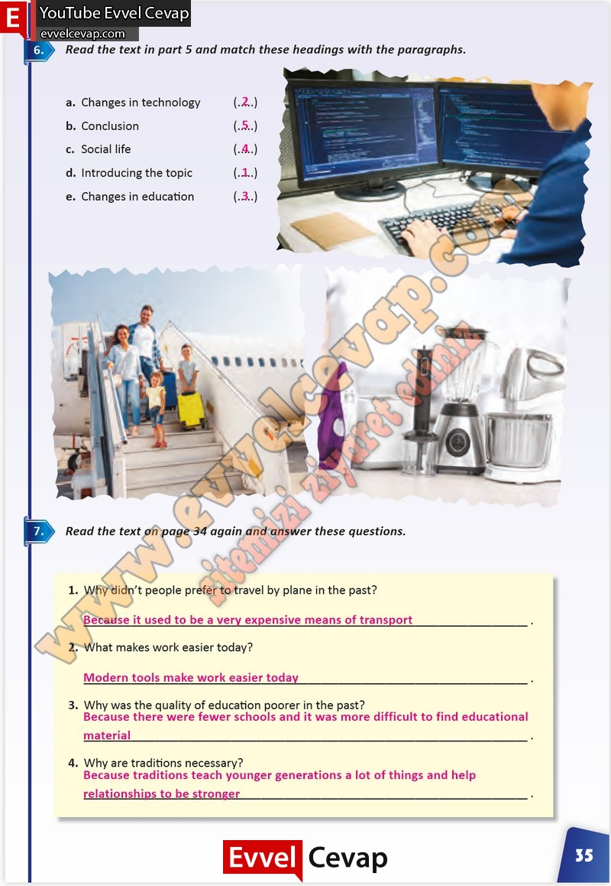

# 10. Sınıf İngilizce Çalışma Kitabı Cevapları Pasifik Yayınları Sayfa 35

---

**Soru: Read the text in part 4 and match these headings with the paragraphs.**

**Soru: Read the text on page 34 again and ansvver these guestions.**

**Soru: Why didn’t people prefer to travel by plane in the past?**

**Soru: What makes work easier today?**

**Soru: Why was the quality of education poorer in the past?**

**Soru: Why are traditions necessary?**

-   **Cevap**:

