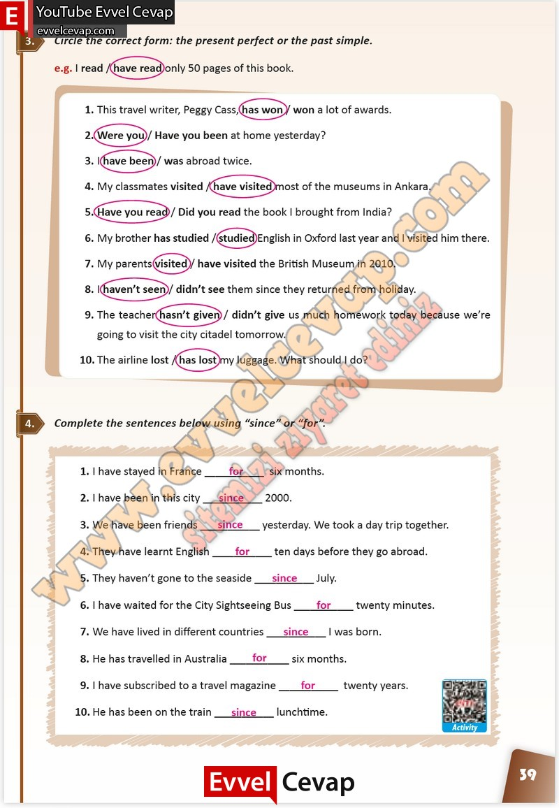

# 10. Sınıf İngilizce Çalışma Kitabı Cevapları Pasifik Yayınları Sayfa 39

---

**Soru: Circle the correct form: the present perfect or the past simple.**

**Soru: Complete the sentences below using “since” or “for”.**

-   **Cevap**:

