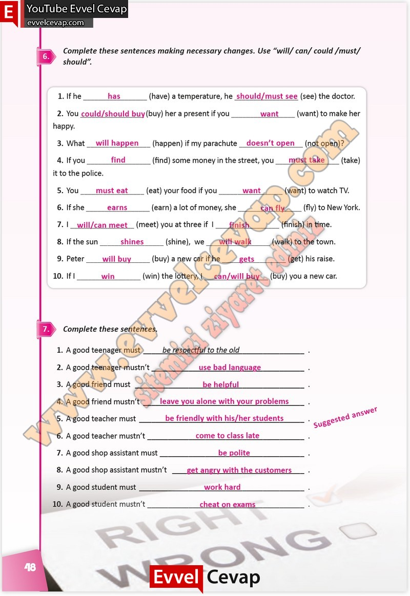

# 10. Sınıf İngilizce Çalışma Kitabı Cevapları Pasifik Yayınları Sayfa 48

---

**Soru: Complete these sentences making necessary changes. Use “will/ can/ could /must/ should”.**

**Soru: Complete these sentences.**

-   **Cevap**:

