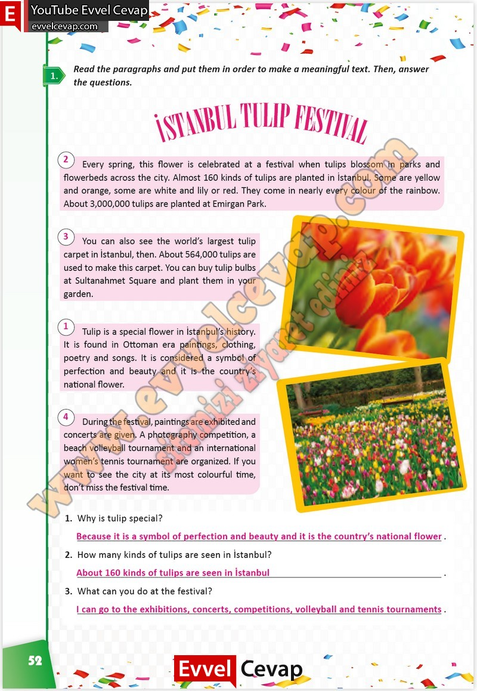

# 10. Sınıf İngilizce Çalışma Kitabı Cevapları Pasifik Yayınları Sayfa 52

---

**Soru: Read the paragraphs and put them in order to make a meaningful text. Then, answer the questions.**

**Soru: Why is tulip special?**

**Soru: How many kinds of tulips are seen in İstanbul?**

**Soru: What can you do at the festival?**

-   **Cevap**:

