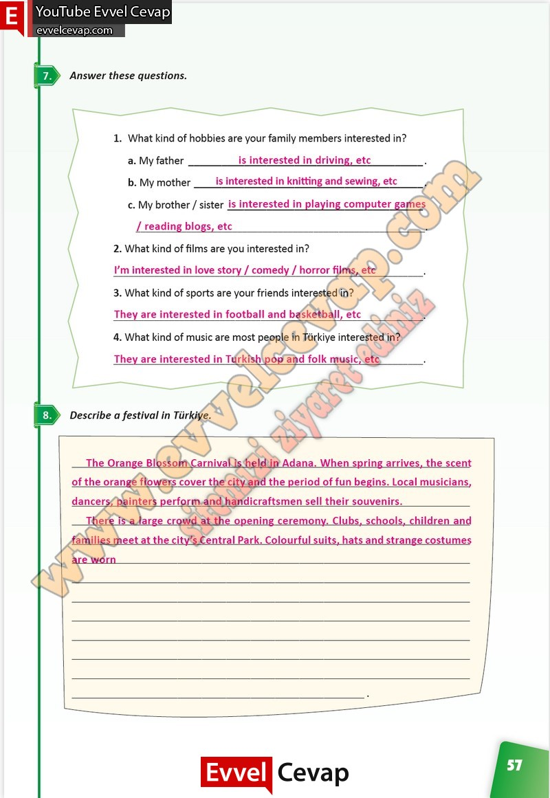

# 10. Sınıf İngilizce Çalışma Kitabı Cevapları Pasifik Yayınları Sayfa 57

---

**Soru: Answer these questions.**

**Soru: What kind of hobbies are your family members interested in?**

**Soru: What kind of films are you interested in?**

**Soru: What kind of sports are your friends interested in?**

**Soru: What kind of music are most people in Türkiye interested in?**

**Soru: Describe a festival in Türkiye.**

-   **Cevap**:

