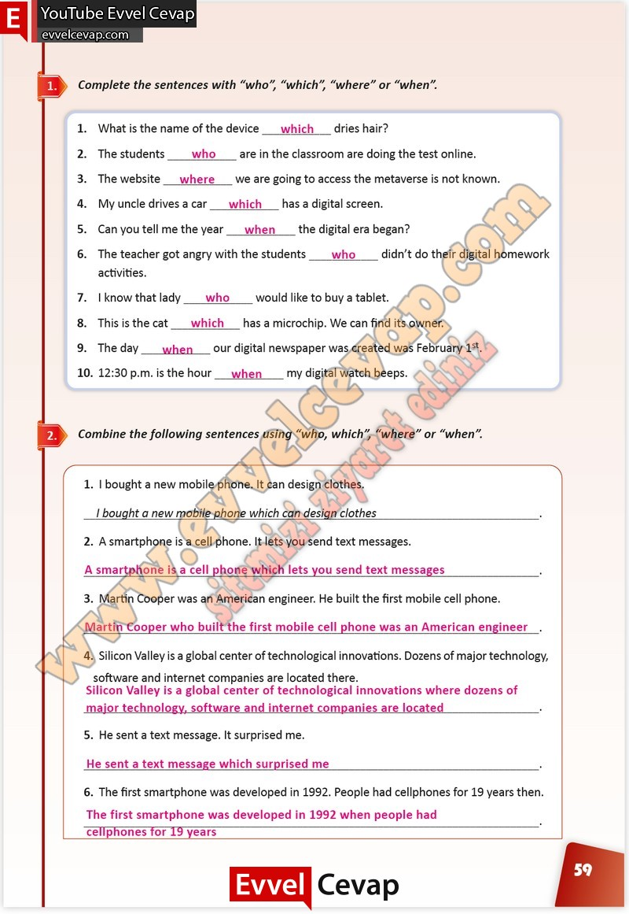

# 10. Sınıf İngilizce Çalışma Kitabı Cevapları Pasifik Yayınları Sayfa 59

---

**Soru: Complete the sentences with “who”, “which”, “where” or “when”.**

**Soru: Combine the following sentences using “who, which”, “where” or “when”.**

-   **Cevap**:

