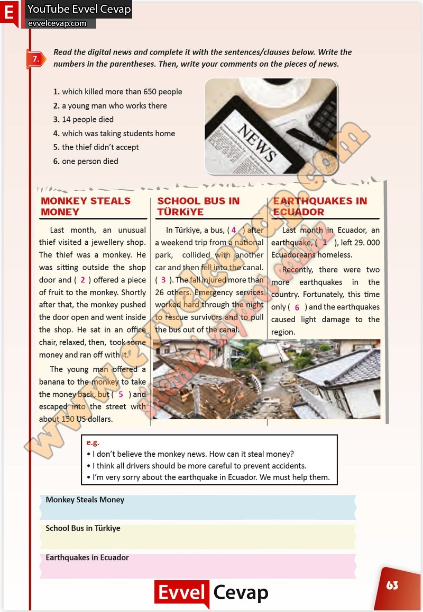

# 10. Sınıf İngilizce Çalışma Kitabı Cevapları Pasifik Yayınları Sayfa 63

---

**Soru: Read the digital news and complete it with the sentences/clauses below. Write the numbers in the parentheses. Then, write your comments on the pieces of news.**

-   **Cevap**:

