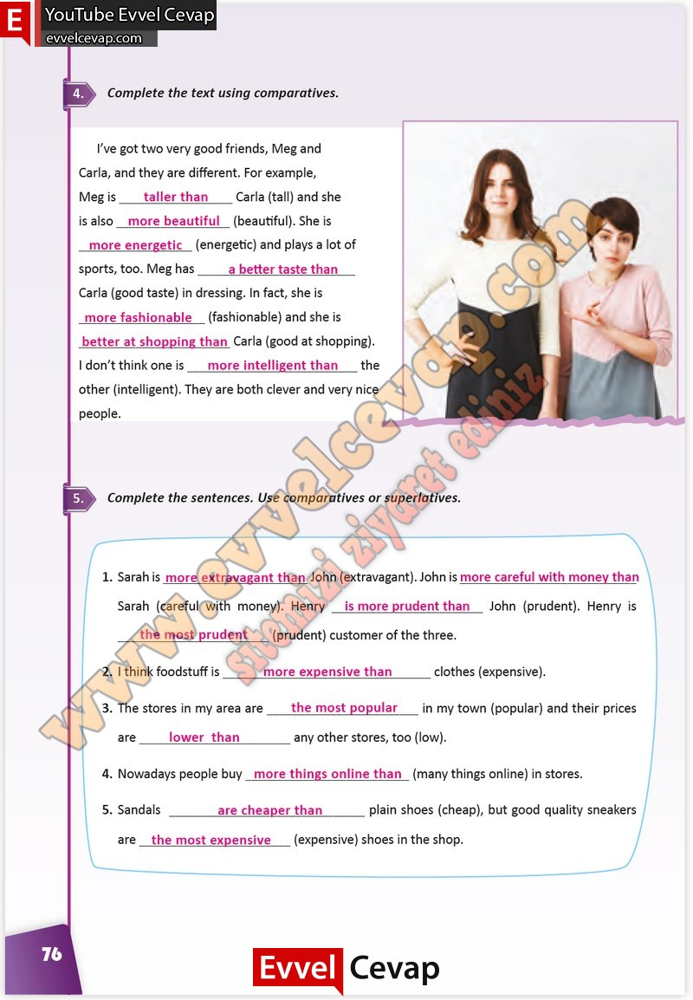

# 10. Sınıf İngilizce Çalışma Kitabı Cevapları Pasifik Yayınları Sayfa 76

---

**Soru: Complete the text using comparatives.**

**Soru: Complete the sentences. Use comparatives or superlatives.**

-   **Cevap**:

