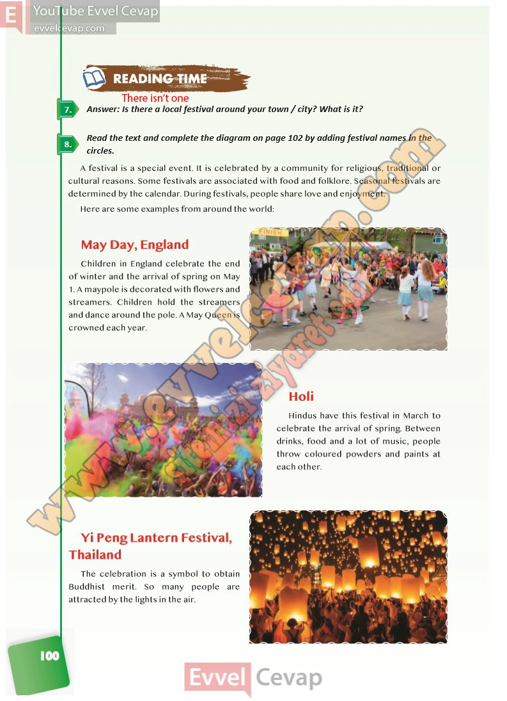

# 10. Sınıf İngilizce Ders Kitabı Cevapları Pasifik Yayınları Sayfa 100

---

**Soru: Answer: Is there a local festival around your town / city? What is it?**

**Soru: Read the text and complete the diagram on page 102 b y adding festival names in the circles.**

-   **Cevap**:

