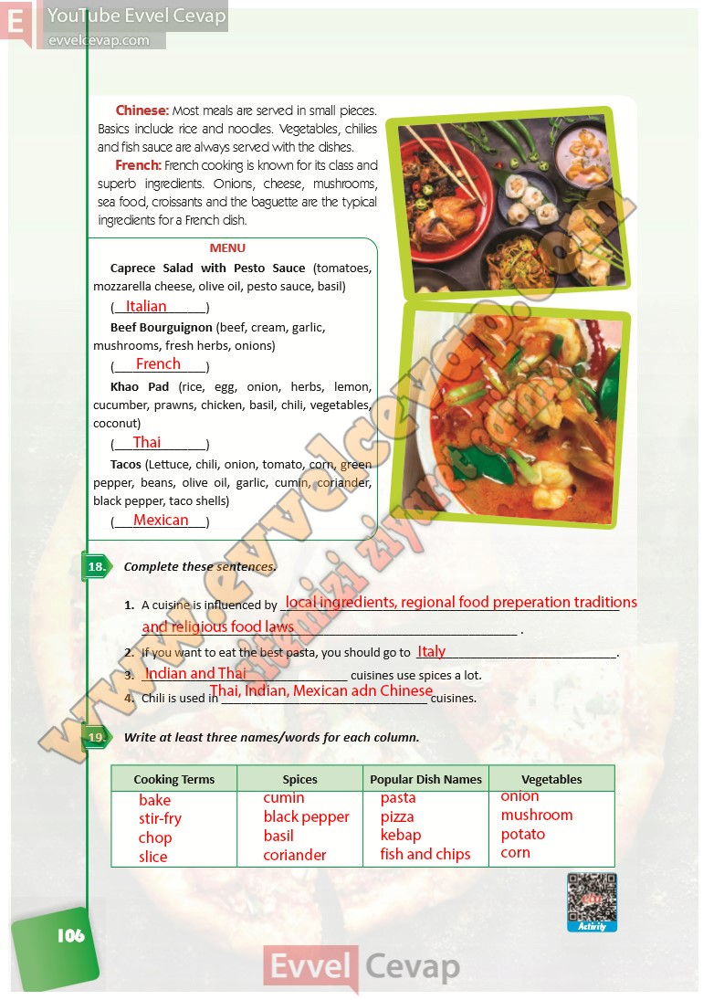

# 10. Sınıf İngilizce Ders Kitabı Cevapları Pasifik Yayınları Sayfa 106

---

Chinese: Most meals are served in small pieces. Basics include rice and noodles. Vegetables, chilies and fish sauce are always served with the dishes.

 French: French cooking is known for its class and superb ingredients. Onions, cheese, mushrooms, sea food, croissants and the baguette are the typical ingredients for a French dish.

Caprece Salad with Pesto Sauce (tomatoes, mozzarella cheese, olive oil, pesto sauce, basil)

 Beef Bourguignon (beef, cream, garlic, mushrooms, fresh herbs, onions)

 Khao Pad (rice, egg, onion, herbs, lemon, cucumber, prawns, chicken, basil, chili, vegetables, coconut)

 Tacos (Lettuce, chili, onion, tomato, corn, green pepper, beans, olive oil, garlic, cumin, coriander, black pepper, taco shells)

**Soru: Complete these sentences.**

**Soru: Write at least three names/words for each column.**

-   **Cevap**:

