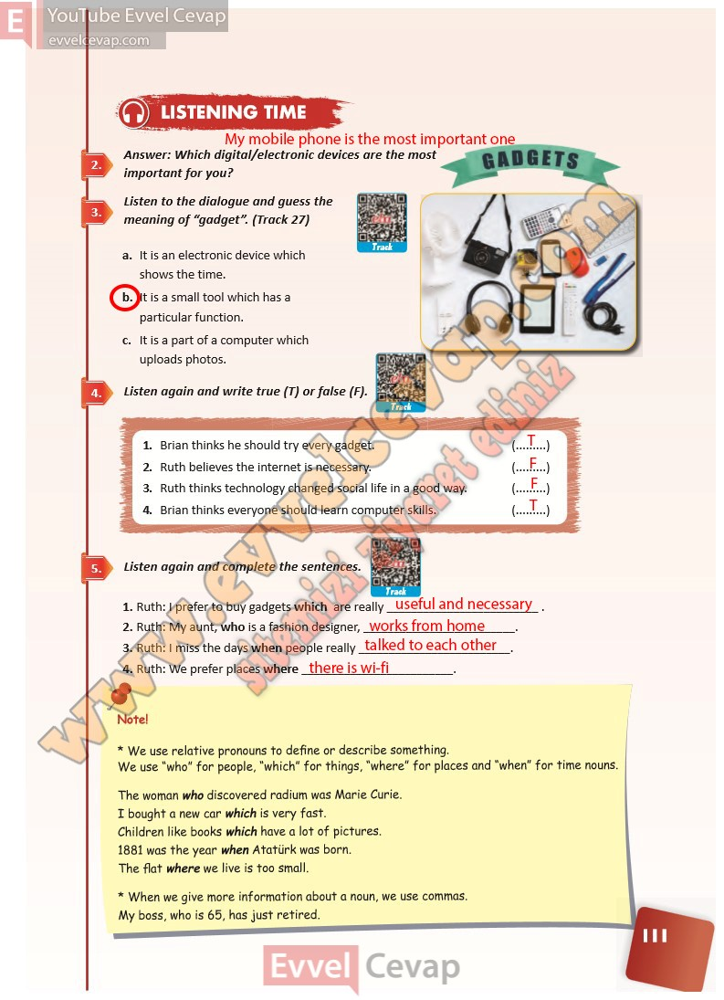

# 10. Sınıf İngilizce Ders Kitabı Cevapları Pasifik Yayınları Sayfa 111

---

**Soru: Answer: Which digital/electronic devices are the most important for you?**

**Soru: Listen to the dialogue and guess the meaning of “gadget”. (Track 27)**

**Soru: Listen again and write true (T) or false (F).**

**Soru: Listen again and complete the sentences.**

-   **Cevap**:

