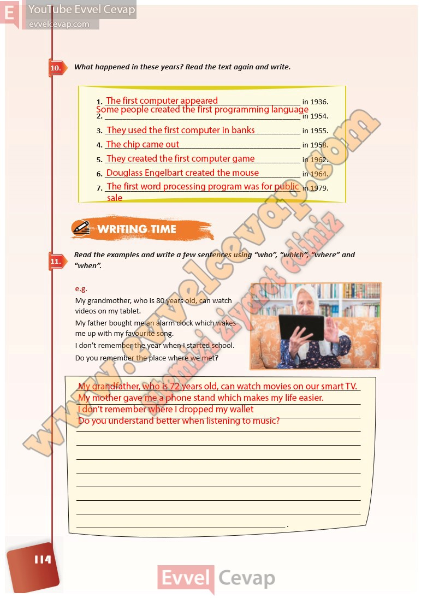

# 10. Sınıf İngilizce Ders Kitabı Cevapları Pasifik Yayınları Sayfa 114

---

**Soru: What happened in these years? Read the text again and write.**

**Soru: Read the examples and write a few sentences using “who”, “which”, “where” and “when”.**

-   **Cevap**:

