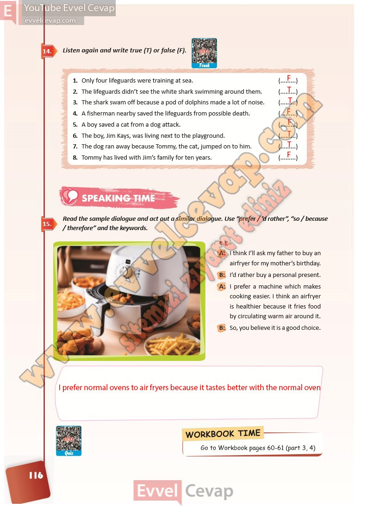

# 10. Sınıf İngilizce Ders Kitabı Cevapları Pasifik Yayınları Sayfa 116

---

**Soru: Listen again and write true (T) or false (F).**

**Soru: Read the sample dialogue and act out a similar dialogue. Use “prefer / ’d rather”, “so / because / therefore” and the keywords.**

-   **Cevap**:

